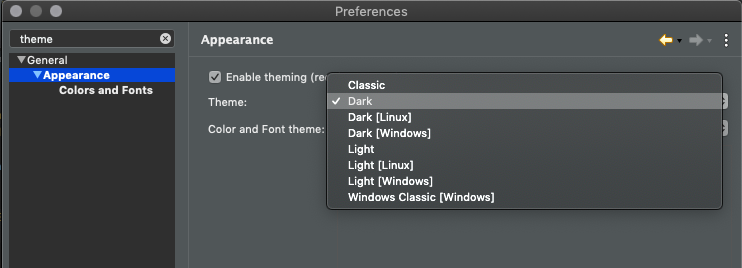
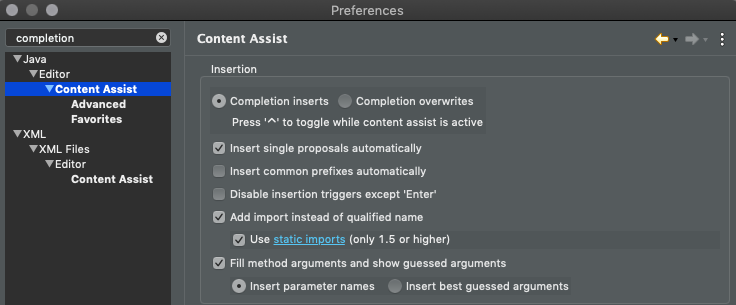

# GuessingGame
Smith College / CSC212 / P0 Starter Code

This opening assignment is worth half of a regular assignment (50 points) in total. Most of it is to practice using our new tools.

## Find your Eclipse Settings

You can open the preferences menu by going to the top of your screen (in Eclipse) and finding the appropriate menu:

- ``Eclipse -> Preferences (Mac)``
- ``Window -> Preferences (Windows)``

### (optional) Maybe you want Dark Mode?

Click on ``General > Appearance`` as shown below, and you can choose a theme. You need to then ``Apply and Close`` and restart Eclipse for it to fully apply.

### (recommended) Disable insertion triggers except 'Enter'

Recent versions of Eclipse autocomplete when you press the space bar, which sometimes means replacing something you've typed with something else! It's very frustrating. You can find this setting ``Java > Editor > Content Assist`` (as shown ***"broken"*** in the image below) and check the box for easier to use autocomplete!

## How to import this project into Eclipse (=10)

There are a lot of steps here! Don't try to memorize them, just practice. Whenever you click next, or open a menu, see if you can read it, guess what you should do next, and confirm with these steps. Doing it this way will help you get through it quicker for future assignments.

1. Go to the "File" menu and choose "Import"
2. Expand the Git Folder and choose "Projects from Git"
3. Click "Next"
4. Choose "Clone URI"
5. Copy and paste [https://github.com/jjfiv/GuessingGame.git](https://github.com/jjfiv/GuessingGame.git) into the URI field.
6. Click "Next"
7. Wait for it to find "master"
8. Click "Next"
9. (optional) Choose a directory to store the project.
10. Click "Next"
11. Choose "Import as general project"
12. Click "Next"
13. Click "Finish"
14. Right-Click on the new project that showed up in the "Package Explorer" on the left. Select "Configure > Convert to Maven Project".

## Find and run the code! (=10)

1. Expand the "GuessingGame" folder, expand the "src/main/java" and "(default package)" folders.
16. Double-Click on ``GuessingGame.java``
17. Run the code. Do one of:
    - Press the Green Run button at the top.
    - Use the Run menu at the top and select Run.
    - Right-Click and choose "Run As > Java Application"
18. The "Console" tab on the bottom should show you the output of the program. (When you implement the rest of the game, you will also need to type here... the cursor looks like it's in the wrong place sometimes but don't worry.)
    
## Implement the rest of the game! (=10)
Remember, type to learn syntax and cite! Use the [solution as example code](https://gist.github.com/jjfiv/767a8041868caae861278659abc063ac).

## Challenge: Improve the Game (=10)

Although we haven't discussed Java syntax, we can identify things that are familiar: loops, if statements, etc.

1. (5) Tell the user "That guess is out of range" if their guess is too high or too low.
1. (5) See if you can a print statement "That was a very good guess!" if the user is within 10 or so of the correct answer. (Think about using the absolute value of their error!)

## Create a Zip file to upload to Moodle (=10)

1. Go to the "File" menu and choose "Export".
2. Expand the "General" folder.
3. Choose "Archive File"
4. Click "Next"
5. Make sure the project you are exporting is checked.
6. Fill in the "To archive file:" field with "YourEmail-P0.zip" e.g., I do "jjfoley-P0.zip"
    You can use the "Browse" button to choose another place for it, like your desktop.
6. Make sure "Save in zip format" is checked.
7. Click "Finish"
8. Upload that zip file to Moodle!
